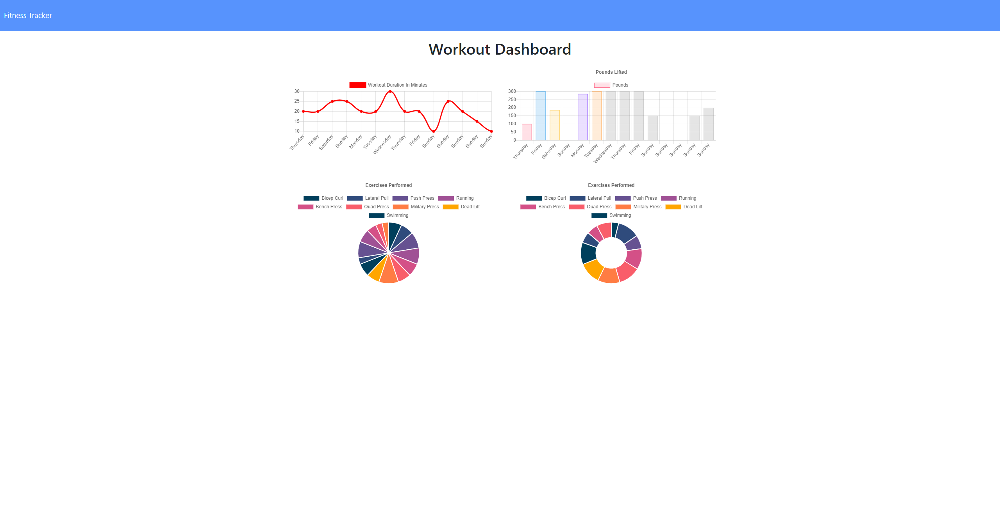

# Workout-Tracker

[Application](https://blooming-shelf-07507.herokuapp.com/)

## Table of Contents
  * [Description](#description)
  * [Installation](#installation)
  * [Usage](#usage)
  * [License](#license)
  * [Contributing](#contributing)
  * [Tests](#tests)
  * [Questions](#questions)

## Description
This application helps the user track their progress through daily workouts. A user can log any number of exercises for the day's workout. They can then see stats and graphs for their completed workouts on the stats page.

## Installation
Fork and clone the repository, then npm install all dependencies. Make sure your connection to MongoDB is working.

## Usage
This project demonstrates how to deploy an application with a MongoDB database.

## License
This project and all of its source code are subject to the MIT license.

## Contributing
Follow the installation guide, then try this out for yourself. If you would like to contribute, either send a pull request on GitHub or see my contact information below.

## Tests
No testing currently exists for this application.

## Questions
Please reach out to me with any questions!

Email: sossw1@gmail.com

GitHub: [sossw1](http://github.com/sossw1)

## Screenshot

